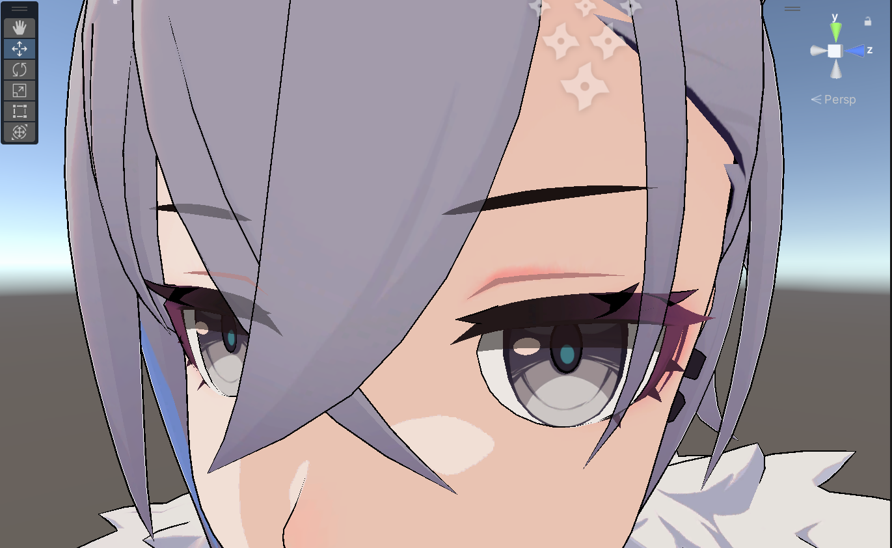

# UnityLearning
What have I done with Unity

## 1.MetaBall
- 基于renderFeature的融球效果
- 暂时使用SetGlobalVector进行数据传输（StructuredBuffer会造成内存泄漏暂未解决）

演示视频地址：https://easylink.cc/y7zlee

## 2. WetShader
- 降饱和度
- 动态uv流动雨滴

- AdditionalLight的影响

ToonShader效果演示视频地址：https://easylink.cc/swah5h
WetShader演示：https://easylink.cc/wymp9
 
## 3. CharacterToonRendering
已完成
- 受MainLight影响的Diffuse/Specular计算
- 边缘光计算 描边计算
- 基于sdf的面部阴影计算
- 双pass眉毛在头发下的半透明 在侧方后方的正确渲染

待完成
- 眼睛的渲染
- 自阴影

演示视频：https://easylink.cc/1iat5x

## 4. Water Rendering
- 基于ComputeShader的FFT快速傅里叶变换计算波浪/法线/白沫
- 基于ReflectPanel/SSR的反射计算
- 基于_CameraOpaqueTexture采样和法线扰动的折射计算
- 基于深度的ramp图采样色彩计算
- 根据屏幕空间坐标的世界重建焦散计算
- 基于几何细分着色器的表面细分

待完成
- 浮力
- 交互

演示视频：https://easylink.cc/vrul6g

## 5. Tree Rendering

- SpeedTree的树的建模和X型叶片的计算
- 使用Blender融球重映射法线
- 卡通风格渲染

演示视频：https://easylink.cc/8pye2p

## 6. SectionRendering

- 基于双Pass的正面正常渲染 背面写入stencil值 在另一张Mesh上根据stencil写入（V1）
- 双Pass 在背部渲染时 加入根据ViewSpace.xy作为uv的图像采样
- 表面程序化流星渲染

## 7. SSR RenderFeature
- 基于URP14的 屏幕空间反射计算
- 基于空间屏幕的光线步进优化

待完成
- 基于Hiz预计算的优化算法

