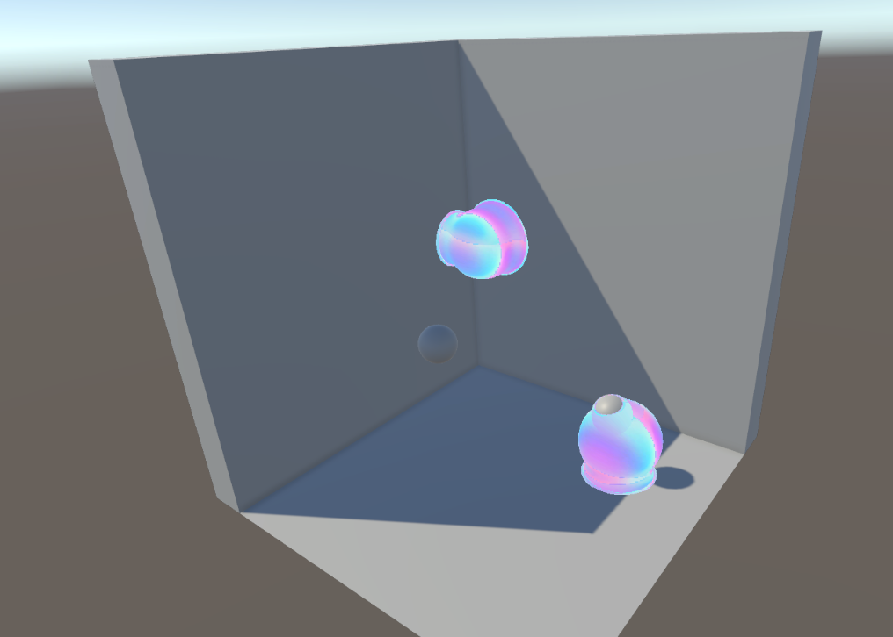
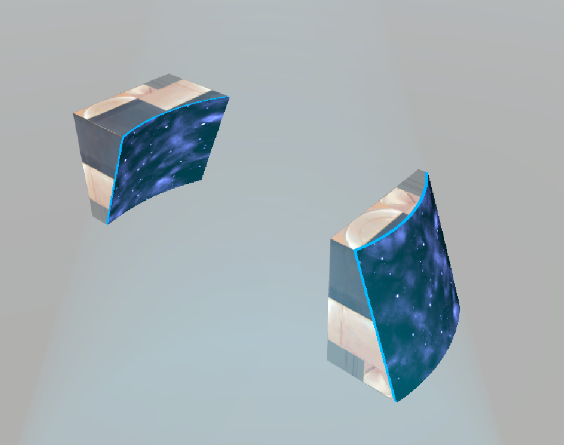
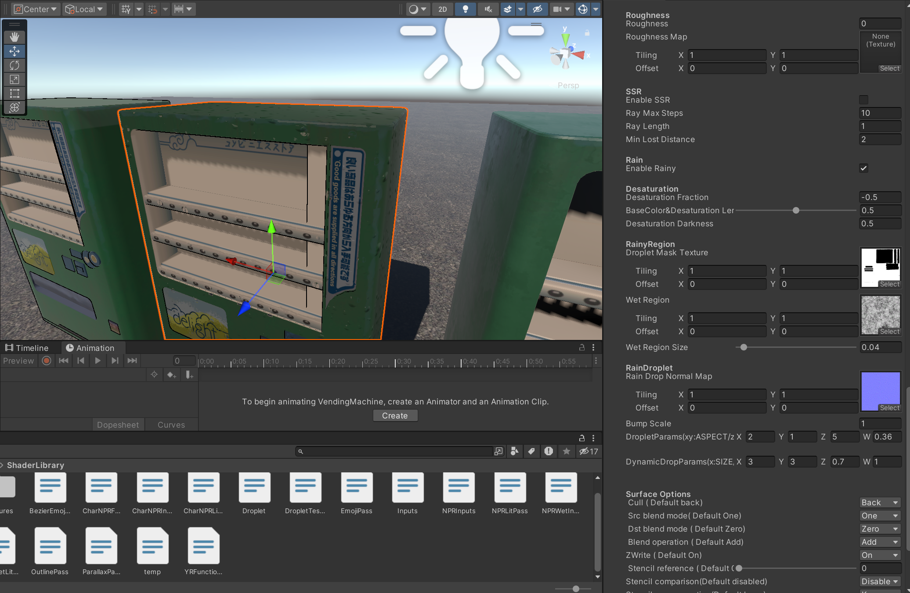
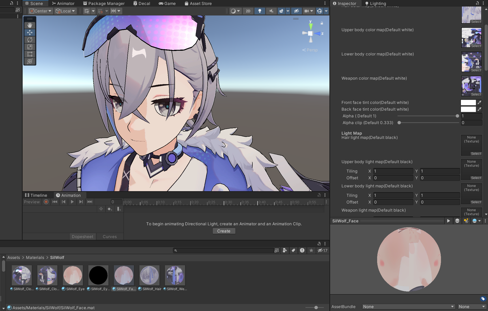
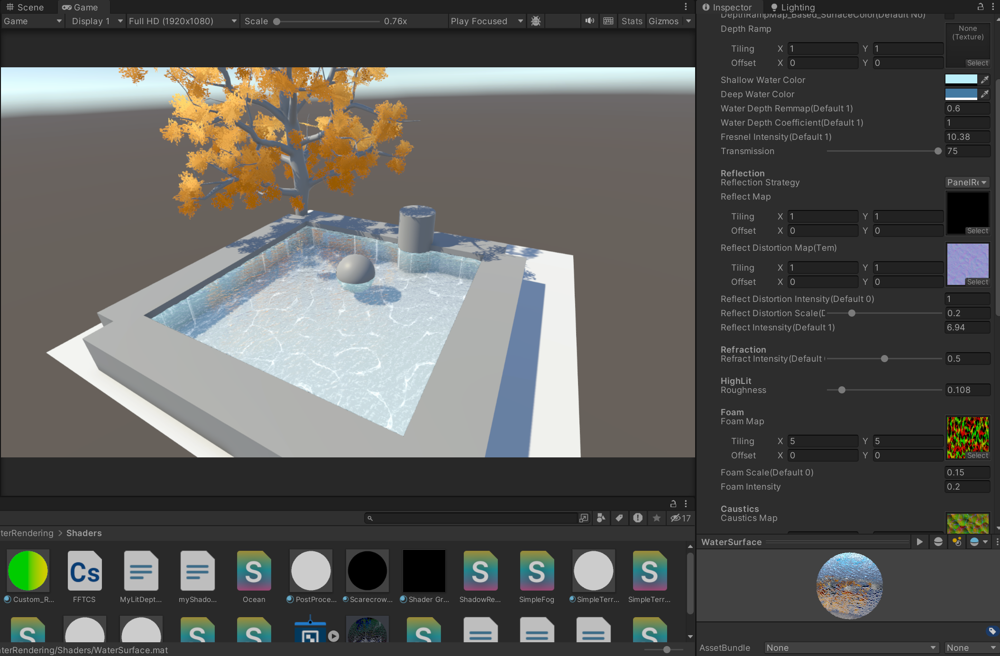
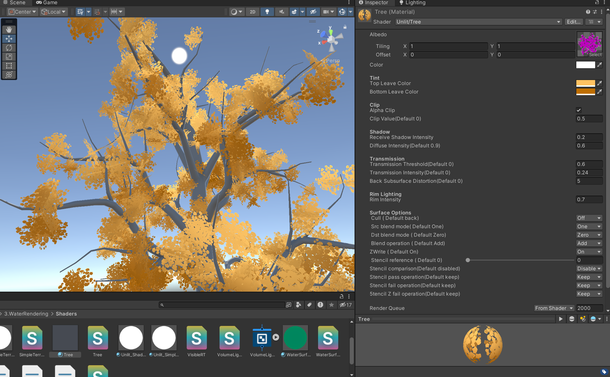

# UnityLearning
keep learning
Unity版本2022.3.28
URP14.0

部分实现文档地址https://www.yuque.com/yuqueyonghu98t8ve/ygpggs
## 1.MetaBall
已完成
- 基于renderFeature控制的融球效果
- 基于SDF进行的视角方向步进以及融球之间和场景拟合的计算
- 暂时使用SetGlobalVector进行数据传输（StructuredBuffer会造成内存泄漏暂未解决）

暂未完成
- StructuredBuffer控制动态修改融球个数
- 更好的CPU端数据传输交互

演示视频地址：https://easylink.cc/y7zlee

## 2. SectionRendering
已完成：
- 基于双Pass的修改stencil值实现背部渲染
- 基于SDF和局部空间步进的背部片元世界坐标对模拟光源的锥体网格局部坐标的重映射
- 基于光线步进的体积光
- 基于SDF距离的靠近描边效果

演示视频地址：https://easylink.cc/iod4mk

## 3. WetShader
已完成：
- 降饱和度
- 动态uv流动雨滴
- AdditionalLight的影响

ToonShader效果演示视频地址：https://easylink.cc/swah5h
WetShader演示：https://easylink.cc/wymp9
 
## 4. CharacterToonRendering
已完成
- 受MainLight影响的Diffuse/Specular计算
- 边缘光计算 描边计算
- 基于sdf的面部阴影计算
- 双pass眉毛在头发下的半透明 在侧方后方的正确渲染

待完成
- 眼睛的渲染
- 自阴影

演示视频：https://easylink.cc/1iat5x

## 5. Water Rendering
已完成
- 基于ReflectPanel/SSR的反射计算
- 基于_CameraOpaqueTexture采样和法线扰动的折射计算
- 基于深度的ramp图采样色彩计算
- 根据屏幕空间坐标的世界重建焦散计算
- 基于几何细分着色器的表面细分

待完成
- 基于ComputeShader的FFT快速傅里叶变换计算波浪/法线/白沫（项目中FFT算法非自己计算）
- 浮力
- 交互

演示视频：https://easylink.cc/vrul6g

## 6. Tree Rendering

- SpeedTree的树的建模和X型叶片的计算
- 使用Blender融球重映射法线

演示视频：https://easylink.cc/8pye2p

## 7. SSR RenderFeature
- 基于URP14的 屏幕空间反射计算
- 基于空间屏幕的光线步进优化

待完成
- 基于Hiz预计算的优化算法

